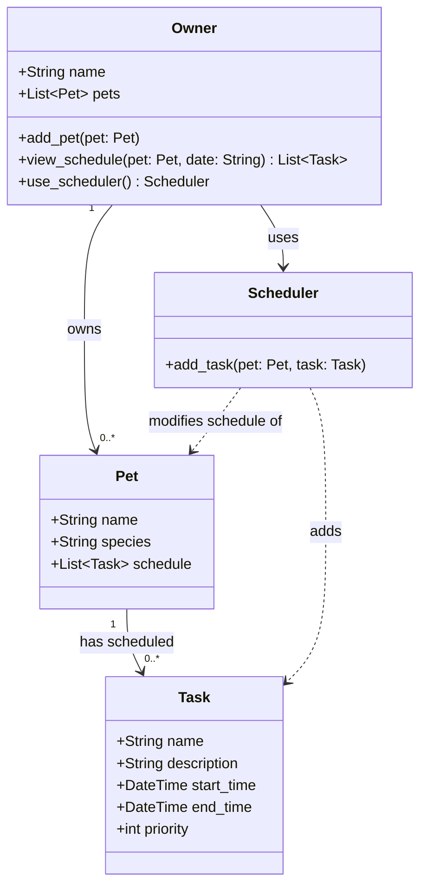

# PawPal+ Class Diagram

```mermaid
classDiagram
    class Owner {
        +String name
        +List~Pet~ pets
        +add_pet(pet: Pet)
        +view_schedule(pet: Pet, date: String) List~Task~
        +use_scheduler() Scheduler
    }

    class Pet {
        +String name
        +String species
        +List~Task~ schedule
    }

    class Task {
        +String name
        +String description
        +DateTime start_time
        +DateTime end_time
        +int priority
    }

    class Scheduler {
        +add_task(pet: Pet, task: Task)
    }

    Owner "1" --> "0..*" Pet : owns
    Owner --> Scheduler : uses
    Pet "1" --> "0..*" Task : has scheduled
    Scheduler ..> Pet : modifies schedule of
    Scheduler ..> Task : adds
```
