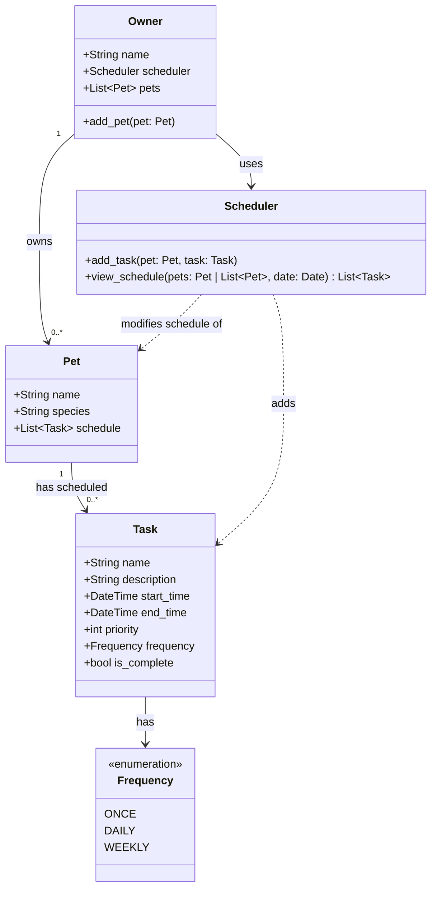

# PawPal+ Class Diagram

```mermaid
classDiagram
    class Owner {
        +String name
        +Scheduler scheduler
        +List~Pet~ pets
        +add_pet(pet: Pet)
    }

    class Pet {
        +String name
        +String species
        +List~Task~ schedule
    }

    class Task {
        +String name
        +String description
        +DateTime start_time
        +DateTime end_time
        +int priority
        +Frequency frequency
        +bool is_complete
    }

    class Frequency {
        <<enumeration>>
        ONCE
        DAILY
        WEEKLY
    }

    class Scheduler {
        +add_task(pet: Pet, task: Task)
        +view_schedule(pets: Pet | List~Pet~, date: Date) List~Task~
    }

    Owner "1" --> "0..*" Pet : owns
    Owner --> Scheduler : uses
    Pet "1" --> "0..*" Task : has scheduled
    Scheduler ..> Pet : modifies schedule of
    Scheduler ..> Task : adds
    Task --> Frequency : has
```
